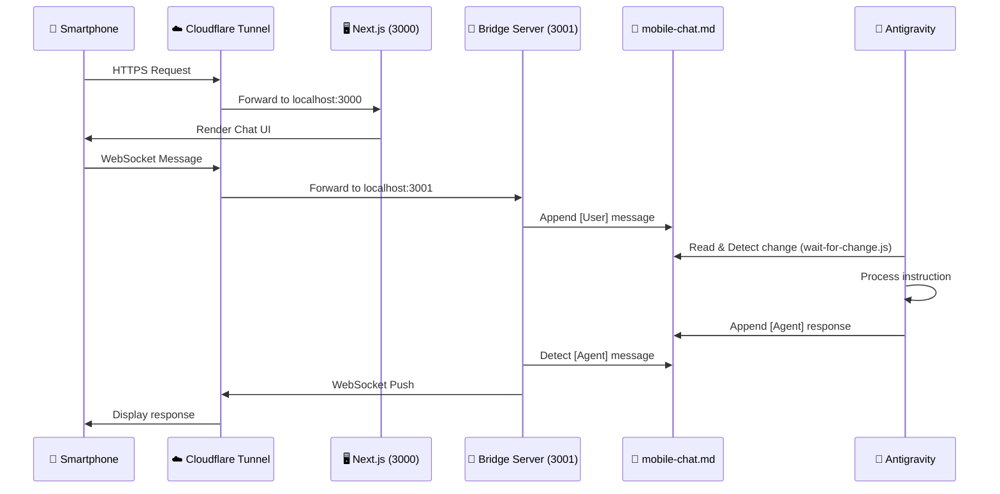
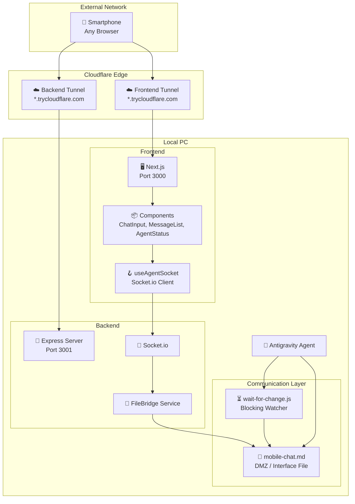

# テクニカルデザインドキュメント (TDD): Antigravity Link - Mobile Bridge

## 1. 概要 (Overview)
* **プロジェクト名**: Antigravity Link (Mobile Bridge)
* **作成者 / ステークホルダー**: User & Antigravity Agent
* **ステータス**: ✅ **完成 (2024-12-18)**
* **バージョン**: 1.0.0

**要約**:
Antigravity IDEのエージェント機能に対し、外出先のスマートフォンから安全にアクセスするための「モバイルブリッジ」アプリケーション。PCで稼働中のエージェントの状態監視、チャットによる指示出し、および緊急時の停止操作を、モバイルに最適化されたプレミアムなUIで提供する。これにより、場所を選ばずに開発エージェントとの協働が可能になる。

---

## 2. 最終アーキテクチャ (Final Architecture)

### システムフロー図


### コンポーネント構成図


---

## 3. ファイル構成 (File Structure)

```
c:\Users\user\.gemini\remote-antigravity\
│
├── 📁 .agent/
│   └── 📁 workflows/
│       └── 📄 remote-bridge.md       # ワークフロー定義（ループ指示付き）
│
├── 📁 bridge-server/                  # バックエンドサーバー
│   ├── 📁 src/
│   │   ├── 📄 app.ts                  # Express設定（CORS, Health Check）
│   │   ├── 📄 socket.ts               # Socket.io + FileBridge統合
│   │   ├── 📄 index.ts                # エントリーポイント
│   │   └── 📁 services/
│   │       └── 📄 FileBridge.ts       # ファイル読み書き・監視サービス
│   ├── 📁 __tests__/
│   │   ├── 📄 server.test.ts          # サーバー統合テスト
│   │   └── 📄 file_bridge.test.ts     # FileBridgeテスト
│   ├── 📄 package.json
│   ├── 📄 tsconfig.json
│   └── 📄 jest.config.js
│
├── 📁 mobile-client/                  # フロントエンド（Next.js PWA）
│   ├── 📁 app/
│   │   ├── 📄 page.tsx                # メインページ
│   │   ├── 📄 layout.tsx              # レイアウト
│   │   └── 📄 globals.css             # グローバルスタイル + アニメーション
│   ├── 📁 components/
│   │   ├── 📄 ChatInput.tsx           # プロンプト入力（自動リサイズ、Haptics）
│   │   ├── 📄 MessageList.tsx         # チャット履歴（スムーズスクロール）
│   │   └── 📄 AgentStatus.tsx         # 状態表示（idle/thinking/acting/error）
│   ├── 📁 hooks/
│   │   └── 📄 useAgentSocket.ts       # Socket.io接続管理フック
│   ├── 📁 types/
│   │   └── 📄 agent.ts                # Message, Role型定義
│   ├── 📁 __tests__/
│   │   ├── 📄 ChatInput.test.tsx
│   │   ├── 📄 AgentStatus.test.tsx
│   │   ├── 📄 MessageList.test.tsx
│   │   ├── 📄 PageIntegration.test.tsx
│   │   └── 📁 hooks/
│   │       └── 📄 useAgentSocket.test.tsx
│   ├── 📄 package.json
│   ├── 📄 tsconfig.json
│   └── 📄 jest.config.js
│
├── 📁 scripts/                        # 運用スクリプト
│   ├── 📄 start-remote.ps1            # 起動（クリーンアップ→サーバー→トンネル）
│   └── 📄 stop-remote.ps1             # 停止（全プロセス終了）
│
├── 📁 logs/                           # ログ出力ディレクトリ
│   ├── 📄 bridge.log
│   ├── 📄 ui.log
│   ├── 📄 tunnel-frontend.log
│   └── 📄 tunnel-backend.log
│
├── 📁 docs/
│   └── 📄 TECHNICAL_DESIGN_DOCUMENT.md  # 本ドキュメント
│
├── 📄 mobile-chat.md                  # 通信インターフェースファイル（DMZ）
├── 📄 wait-for-change.js              # 待機スクリプト（安全装置付き）
└── 📄 .gitignore
```

---

## 4. コア機能と実装詳細

### 4.1 FileBridge（ファイルベース双方向通信）

**設計思想**: 
複雑なAPI連携を排除し、**たった一つのテキストファイル（mobile-chat.md）** を「DMZ（非武装地帯）」として共有することで、システム全体の複雑性を劇的に下げています。

```typescript
// FileBridge の主要機能
class FileBridge {
    writeMessage(message: string, sender: 'user' | 'agent'): Promise<void>
    readContent(): Promise<string>
    getNewContent(): Promise<string>  // 差分取得
    startWatching(): void             // 変更監視開始
    stopWatching(): void              // 監視停止
}
```

### 4.2 wait-for-change.js（ブロッキング待機 + 安全装置）

**問題**: Antigravityは「会話駆動型」であり、自律的にループできない。
**解決**: ブロッキングスクリプトを実行させることで、疑似的な常時接続を実現。

```javascript
// 安全装置: 無限自己応答ループの防止
function getLastMessageSender(content) {
    // 最後のメッセージが [Agent] なら無視
    // 最後のメッセージが [User] なら検知→終了
}
```

### 4.3 useAgentSocket（フロントエンド接続フック）

```typescript
interface UseAgentSocketReturn {
    messages: Message[];           // メッセージ履歴
    status: AgentStatus;           // idle | thinking | acting | error
    isConnected: boolean;          // 接続状態
    sendMessage: (content: string) => void;  // 送信
    stopAgent: () => void;         // 停止
}
```

---

## 5. 運用手順

### 5.1 外出モード起動

```
/remote-bridge
```

または手動で:
```powershell
.\scripts\start-remote.ps1
node wait-for-change.js  # ループ実行
```

### 5.2 帰宅時の停止

```powershell
.\scripts\stop-remote.ps1
```

---

## 6. テスト結果

| テストスイート | テスト数 | 結果 |
|---------------|---------|------|
| ChatInput.test.tsx | 6 | ✅ PASS |
| AgentStatus.test.tsx | 4 | ✅ PASS |
| MessageList.test.tsx | 5 | ✅ PASS |
| useAgentSocket.test.tsx | 5 | ✅ PASS |
| PageIntegration.test.tsx | 5 | ✅ PASS |
| server.test.ts (Bridge) | 3 | ✅ PASS |
| file_bridge.test.ts | 2 | ✅ PASS |
| **合計** | **30** | **✅ ALL PASS** |

---

## 7. セキュリティ考慮事項

| 項目 | 現状 | 推奨（本番運用時） |
|------|------|------------------|
| 外部公開 | Quick Tunnel（URLランダム） | Named Tunnel + Cloudflare Access |
| 認証 | なし | Basic認証 or JWT |
| CORS | `*`（全許可） | 特定ドメインのみ |
| HTTPS | ✅ Cloudflare経由で自動 | ✅ |

---

## 8. 今後の拡張案

- [ ] PWA化（ホーム画面追加、オフライン対応）
- [ ] プッシュ通知（Service Worker）
- [ ] 履歴の永続化（SQLite / IndexedDB）
- [ ] 音声入力対応（Web Speech API）
- [ ] Named Tunnel + Cloudflare Access による常設化

---

## 9. 変更履歴

| 日付 | バージョン | 内容 |
|------|-----------|------|
| 2024-12-18 | 0.1.0 | 初版作成（設計フェーズ） |
| 2024-12-18 | 1.0.0 | 完成版（全Phase実装完了） |

